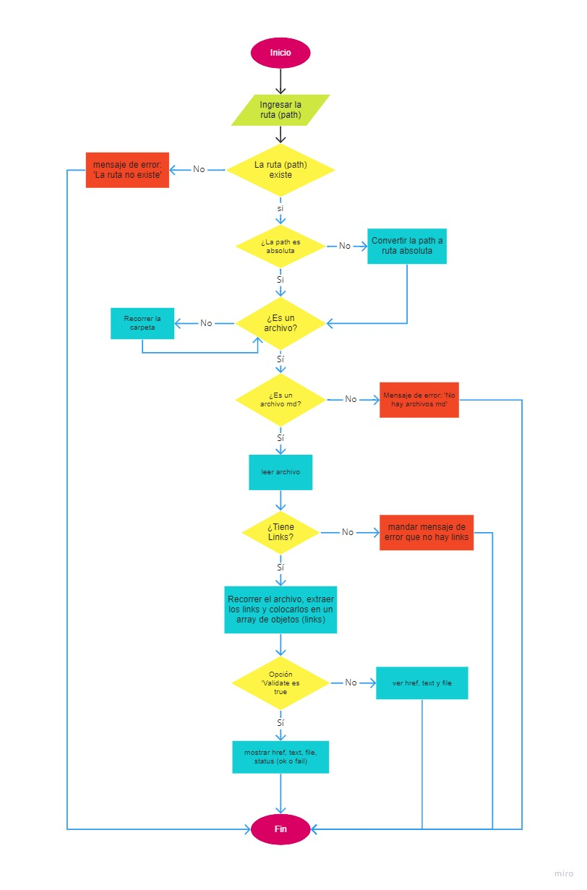
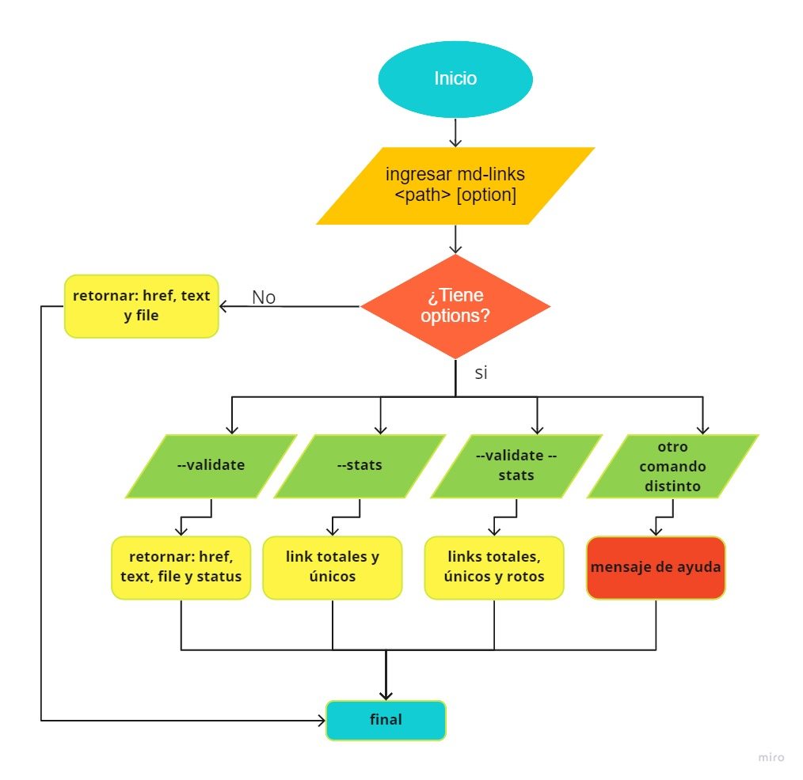
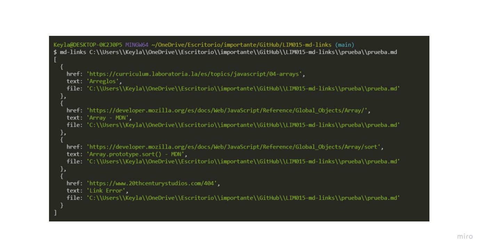
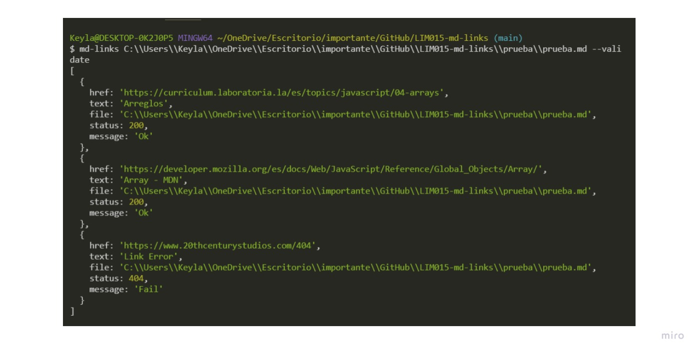
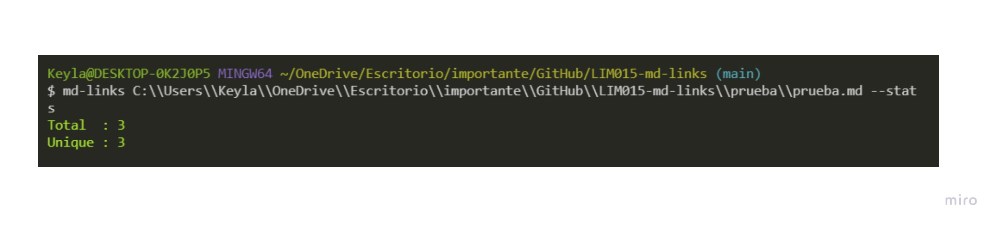
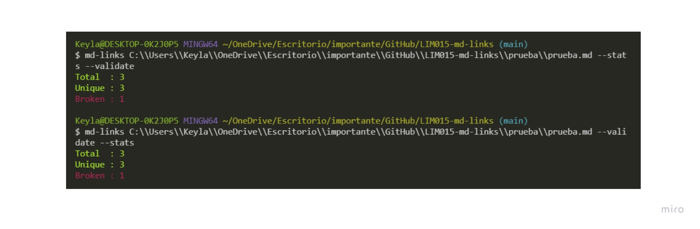

# Markdown Links

## Índice

- [1. Resumen del Proyecto](#1-resumen-del-proyecto)
- [2. Diagramas de Flujo](#2-diagramas-de-flujo)
- [3. Instalación ](#3-objetivos-de-aprendizaje)
- [4. Guía de Uso ](#4-guia-de-uso)

---

## 1. Resumen del Proyecto

[Markdown](https://es.wikipedia.org/wiki/Markdown) es un lenguaje de marcado
ligero muy popular entre developers. Es usado en muchísimas plataformas que
manejan texto plano (GitHub, foros, blogs, ...), y es muy común
encontrar varios archivos en ese formato en cualquier tipo de repositorio
(empezando por el tradicional `README.md`).

Estos archivos `Markdown` normalmente contienen _links_ (vínculos/ligas) que
muchas veces están rotos o ya no son válidos y eso perjudica mucho el valor de
la información que se quiere compartir.

Esta es una herramienta (librería) que usando [Node.js](https://nodejs.org/), lee y analiza archivos
en formato `Markdown`, para verificar los links que contengan y reportar
algunas estadísticas.

## 2. Diagramas de Flujo

### API

  

### CLI (Command Line Interface - Interfaz de Línea de Comando)

  

## 3. Instalación

Podemos instalar esta librería empleando cualquiera de los siguientes comandos: 

  #### Por npm:

  `$ npm i md-links-lim015`

  #### Desde github:

   `npm i --global keylaMia/LIM015-md-links`

## 4. Guía de Uso

El comportamiento por defecto no debe validar si las URLs responden ok o no,
solo debe identificar el archivo markdown (a partir de la ruta que recibe como
argumento), analizar el archivo Markdown e imprimir los links que vaya
encontrando, junto con la ruta del archivo donde aparece y el texto
que hay dentro del link (truncado a 50 caracteres).

por ejemplo: 

#### Options

##### `--validate`

Si pasamos la opción `--validate`, el módulo debe hacer una petición HTTP para
averiguar si el link funciona o no. Si el link resulta en una redirección a una
URL que responde ok, entonces consideraremos el link como ok.

Por ejemplo:

Vemos que el _output_ en este caso incluye la palabra `ok` o `fail` después de
la URL, así como el status de la respuesta recibida a la petición HTTP a dicha
URL.

##### `--stats`

Si pasamos la opción `--stats` el output (salida) será un texto con estadísticas
básicas sobre los links.

Por ejemplo: 

También podemos combinar `--stats` y `--validate` para obtener estadísticas que
necesiten de los resultados de la validación.

por ejemplo: 

#### Mensajes 

Si pasamos la ruta mal escrita, la consola arrojará el mensaje siguiente:
`
                    ───▄▀▀▀▄▄▄▄▄▄▄▀▀▀▄───
                    ───█▒▒░░░░░░░░░▒▒█───
                    ────█░░█░░░░░█░░█────
                    ─▄▄──█░░░▀█▀░░░█──▄▄─
                    █░░█─▀▄░░░░░░░▄▀─█░░█
█░░ ▄▀█   █▀█ █░█ ▀█▀ ▄▀█   █▄░█ █▀█   █▀▀ █▀   █░█ ▄▀█ █░░ █ █▀▄ ▄▀█
█▄▄ █▀█   █▀▄ █▄█ ░█░ █▀█   █░▀█ █▄█   ██▄ ▄█   ▀▄▀ █▀█ █▄▄ █ █▄▀ █▀█

`

Si pasamos la ruta bien escrita con alguna opción no válida, la consola arrojará lo siguiente:

`

                                  »»————-　♡　————-««

Recuerda que debes ingresar el siguiente comando: md-links <ruta> <comando>
                                 ──────▄▀▄─────▄▀▄
                                 ─────▄█░░▀▀▀▀▀░░█▄
                                 ─▄▄──█░░░░░░░░░░░█──▄▄
                                 █▄▄█─█░░▀░░┬░░▀░░█─█▄▄█
1) --validate
Al ingresar esta opción te indicaremos el href, title, file, status y message de cada link.
2) --stats
Al ingresar esta opción te indicaremos el número de links totales y único. 
3) --validate --stats
Al ingresar esta opción te indicaremos el número de links totales, únicos y rotos.

                                  »»————-　♡　————-««
`

## 5. Autora
Keyla Mialu Jimenez Gallegos - Lim015 Laboratoria
[keylaMia](https://github.com/KeylaMia))  